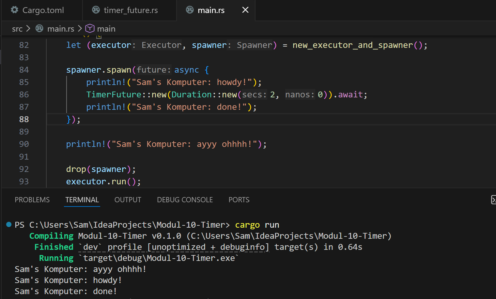

# Modul 10 Timer

## Experiment 1.2

Pada experiment ini, baris yang saya tambahkan adalah `Sam's Komputer: ayyy ohhhh!`. Setelah di-run dan diamati, ternyata `ayyy ohhhh!` muncul, baru setelah itu muncul `howdy!`, lalu akhirnya dua detik kemudian muncul `done!`. Ini menunjukkan bahwa tidak semua bagian program berjalan dan tampil di waktu yang sama. Ada output yang langsung keluar lebih awal, kemudian ada output lain yang muncul setelah menunggu proses berikutnya. Jadi dari percobaan ini bisa dilihat bahwa urutan output memang bisa berbeda sesuai alur jalannya program.

## Experiment 1.3
