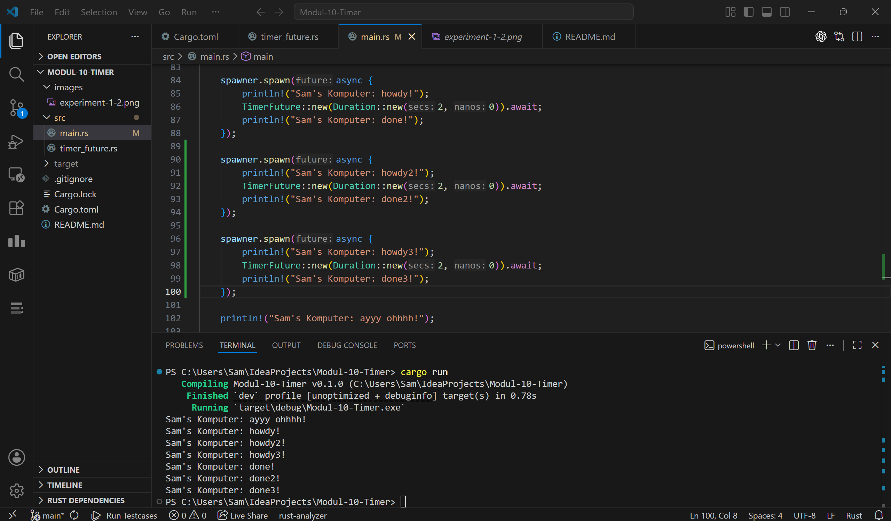
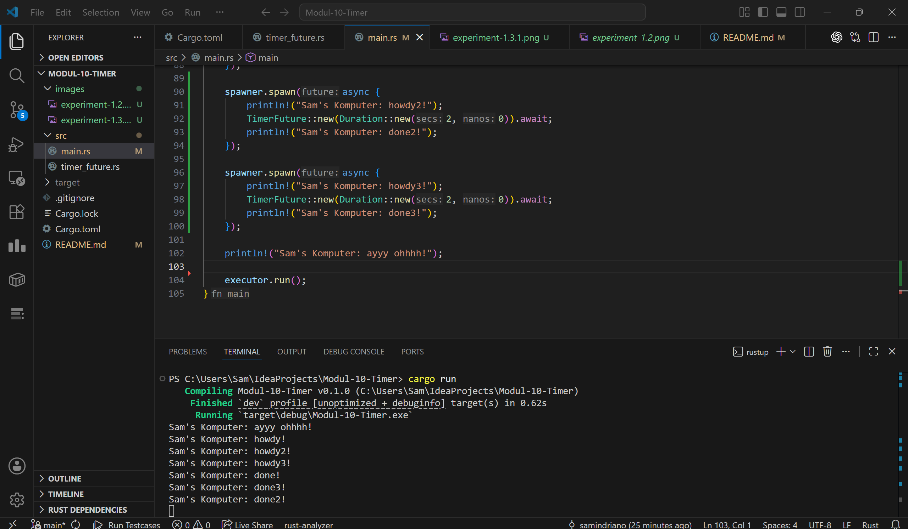

# Modul 10 Timer

## Experiment 1.2

Pada experiment ini, baris yang saya tambahkan adalah `Sam's Komputer: ayyy ohhhh!`. Setelah di-run dan diamati, ternyata `ayyy ohhhh!` muncul, baru setelah itu muncul `howdy!`, lalu akhirnya dua detik kemudian muncul `done!`. Ini menunjukkan bahwa tidak semua bagian program berjalan dan tampil di waktu yang sama. Ada output yang langsung keluar lebih awal, kemudian ada output lain yang muncul setelah menunggu proses berikutnya. Jadi dari percobaan ini bisa dilihat bahwa urutan output memang bisa berbeda sesuai alur jalannya program.

## Experiment 1.3

Pada experiment ini, saya coba run beberapa task sekaligus dengan menambahkan beberapa `spawner.spawn()`. Dari hasil run, terlihat bahwa semua pesan `howdy` muncul lebih dulu, lalu pesan `done` baru muncul setelah delay timer selesai. Hal ini terjadi karena task berjalan secara asynchronous, jadi program tidak harus menunggu satu timer selesai dulu sebelum menjalankan task lain. Disini `spawner` digunakan untuk memasukkan task ke queue, sedangkan `executor` yang mengambil dan menjalankan task tersebut. Saat `drop(spawner)` tetap dipakai, program bisa selesai dengan normal karena executor tahu bahwa tidak ada task baru lagi yang akan dikirim. Sedangkan saat `drop(spawner)` dihapus, output tetap muncul tapi program tidak langsung selesai karena channel untuk mengirim task masih dianggap terbuka. Jadi, percobaan ini menunjukkan bahwa `spawn`, `spawner`, `executor`, dan `drop(spawner)` saling berhubungan untuk mengatur kapan task asynchronous dibuat, dijalankan, dan dihentikan.
